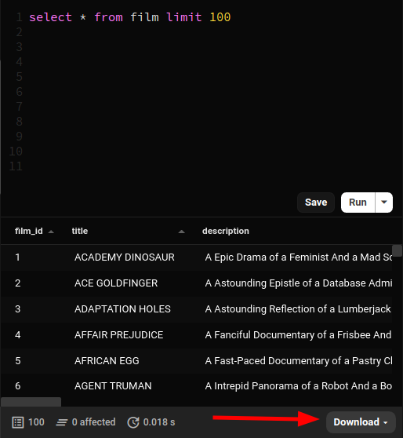
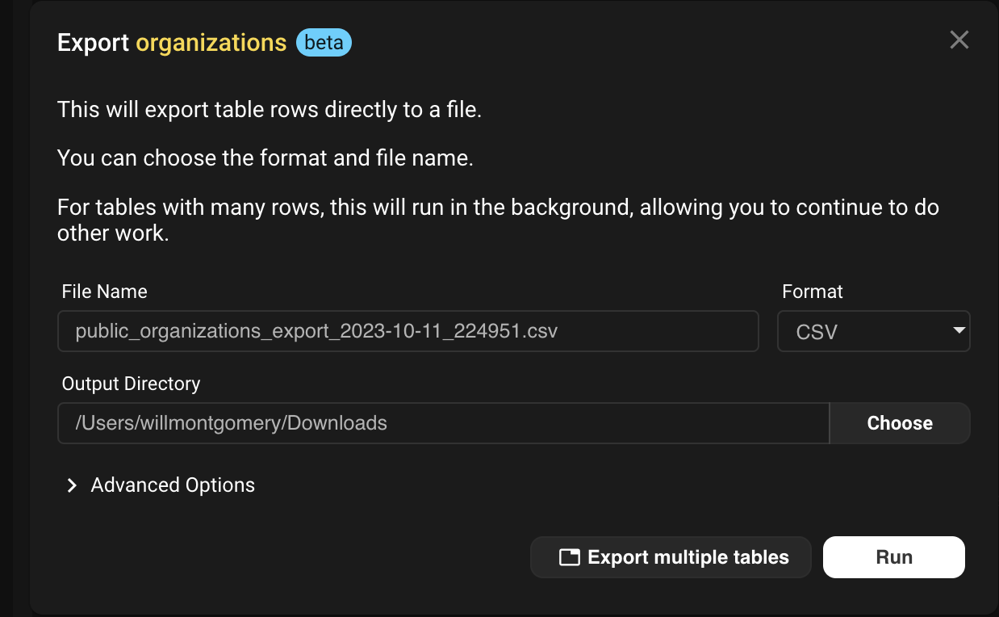
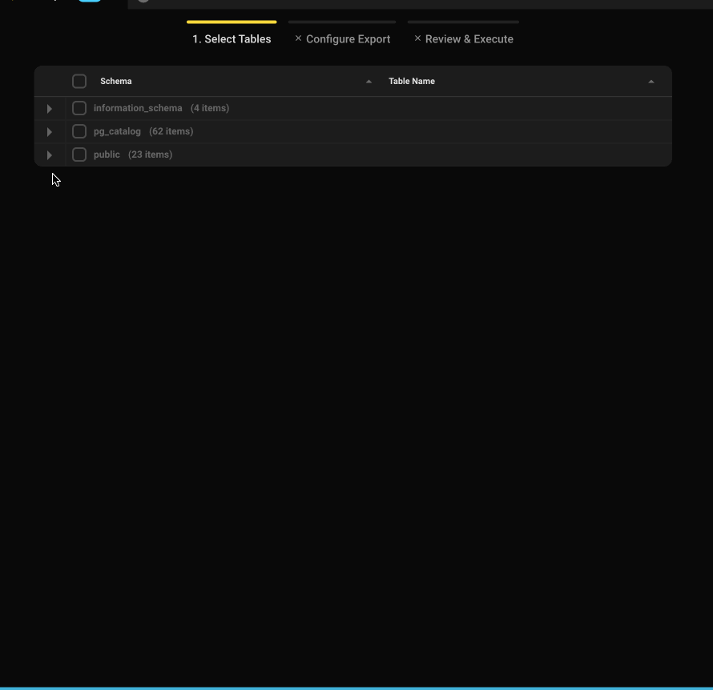
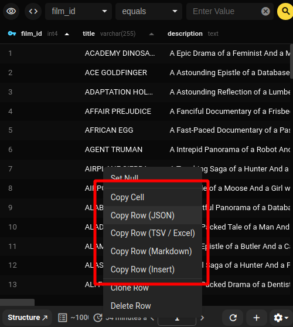

There are two ways you can export database data in Beekeeper Studio.

1. Exporting the results of a SQL query
2. Exporting a whole table(s), or a filtered table view
3. Copying individual rows

## Export Formats

Beekeeper supports saving data in a number of formats

## Exporting SQL query results

After running your query in the [[using-the-sql-editor|SQL Editor]], click the `download` button to export the results in a supported format.

You can choose to either download as a file, or copy the result to your clipboard.

### Supported Download Formats

- CSV
- Excel
- JSON
- Markdown
- Excel friendly TSV for pasting into Excel or Google Sheets

### Limits on SQL query downloads

By default Beekeeper Studio limits query results to 20,000 records (so you don't crash the app). This limit also applies to the download (for the timebeing).

## Exporting a table or tables

Exporting a table is a little more complex, because a table could contain millions of records.

When you export a table, tables, or filtered table view, Beekeeper Studio will execute the query and then stream the results to the download file.

There are a few options to get started:
- Go to the table explorer view, click the ⚙ icon in the bottom right, and choose `Export`.
- Right click the table and select `Export to File`.
- [Select `Export Data` from the app toolbar.](#multitable)

You can choose the location of the final file, and the format of the export, along with some advanced options, where appropriate (like pretty printing JSON exports).

From here, simply click run to start the process and generate your export.

Exporting a large table can take a long time. You'll see a notification in the bottom right of the app to indicate the progress as it runs.

### Need Multiple Tables?
{: #multitable }
Beekeeper has you covered. Either select `Export multiple tables` on the export modal or go through the app toolbar.

All tables in the database will be shown grouped by schemas (if the database supports them) and you have the ability to select all tables in a schema (or all of them really) with a simple click or pick and choose what you want.

Each table is stored as a seperate file with a determined format of `table_name_whatever-you-added.extension`. All other options work the same as exporting one table.

This export process can take a long time depending on table size and number of tables being exported.

### Table export formats

- CSV
- SQL (insert)
- JSON
- Newline delimited JSON (JSONL)

## Copying individual rows

For any table in Beekeeper Studio, whether in the table explorer or the query results, you can right-click a cell and choose to export the whole row in a number of formats.

### Row copy formats

- [Excel-friendly TSV](#tsv)
- JSON
- Markdown
- SQL Insert

## Easily copy database data and paste into Excel and Google Sheets
{: #tsv }

Beekeeper Studio's row-copy format is designed to allow the quick and easy pasting of data into Google Sheets and Microsoft Excel.

Pasting data into a spreadsheet using this format will allow your spreadsheet software to automatically parse the data and distribute it across columns correctly.

I added this feature because this is one of my pet-peeves with copying data from other tools.

